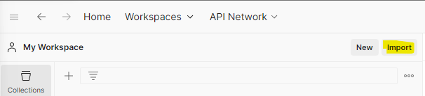
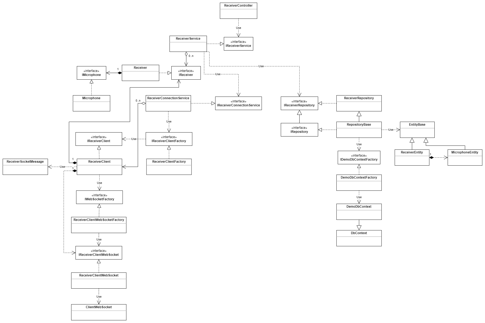
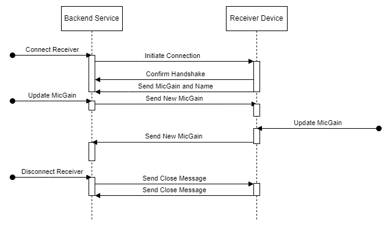
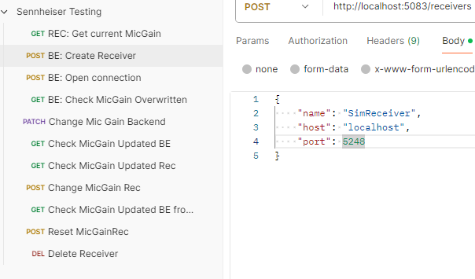
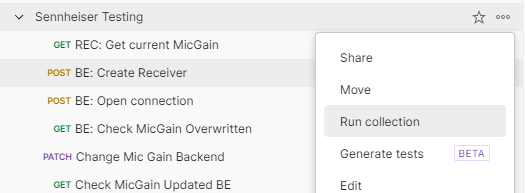
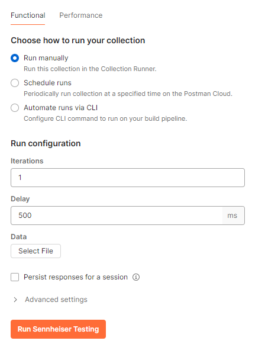

# Sennheiser Backend

## Prerequisites
1. **Install Postman**  
Scenario tests are written for Postman, so Postman needs to be installed first.
1. **Import collection to Postman**  
You can find the postman collection description under `/Scenario Tests/Sennheiser Testing.postman_collection.json`


## Projects
**SennheiserBackend**  
The main application representing the backend which will act as mediator between UI and actual receiver device.

**SennheiserBackend.Tests**  
Unit and integration tests for SennheiserBackend.

**SennheiserDeviceSimulator**  
Simulates the receiver device, supporting the properry MicGain.

## Technology

The backend service is a ASP.NET Web API, providing rest endpoints to control the backend. These endpoints could be called by any capable UI.

The simulator is a ASP.NET Web API as well and populates endpoints to get and set the MicGain property for the receiver device it simulates.

Simulator and backend connect via unsecured HTTP websockets.

The database used is SQLite in file mode, during integration tests in memory mode.

## Software architecture
[](images/architecture.png)

## Protocol flow
[](images/protocol.png)

## General design principles
* Usage of MVC pattern, where the JSON output will represent the view.
* Dependency Injection pattern for testability and modularity.
* Singleton pattern for internal state model and singular services.
* Program against interfaces where possible and useful.
* Repository pattern for separation of database and business logic.
* Separate DB entities and the model. Entities are POCO DTOs while the model can hold business model related logic (as for mic gain being between 0..100).
* Use generic methods where useful.
* Store common logic and properties in abstract base classes.
* Use non-blocking calls where possible.
* Unit tests target high branch coverage.
* Mock dependencies for unit tests.
* Integration test repository to avoid mocking EF core's DbContext
* Factory pattern for testability of privately constructed classes.
* Facade pattern for testability of sealed, privately constructed classes.
* Service pattern to hold responsibility for certain logic and models and seperate controller logic from repositories.
* Public service APIs return copies of objects through interfaces, to prevent model manipulation outside the service.
* Caching is done for DB and DB entries are only written if modified. Since the assumption is that only the backend will modify the database as a single instance, caching is not affected by incoming DB changes.
* Global exception handler for handling controller exceptions and define associated HTTP status codes globally. Also for keeping stack traces out of HTTP responses.
* Use extension methods for very generic and globally useful operations on objects.
* Retry pattern for write concurrency on receiver side
* Pessimistic locking by receiver (but not by API)

## How to use
Both applications provide native Swagger UI access which is opened automatically, when debugging is started. Using Swagger UI both services can easily be controlled manually.

The backend service also provides detailed logging to stdout.

The simulation provides a virtual device with the following parameters:

Host: localhost
Port: \<see log output when starting sim\>
Name: SimReceiver

The PATCH endpoint for receivers allows modification of the receiver object using JsonPatch. To set the MicGain property to e.g. 60, the following PatchDocument is required:

```
[  
  {  
    "operationType": 0,  
    "path": "Microphone/MicGain",  
    "op": "add",  
    "value": 60  
  }  
]
```

## Concurrent writes and testing
The backend is designed to ensure that the receiver will have precedence when writing its state by use of pessimistic locking. During the message handling, 
the receiver state is locked in the local model cache and the database. In case the receiver state is updated by the API and is blocking the database when a message arrives, 
a retry mechanism will try to override the concurrent change from the API as soon as it is completed.  

Since it is hard to achieve to send requests in a away that they will collide in a very small timeframe, the behavior is proved by unit tests that artificially block the processing of each case seperately. The relevant tests are *OnReceiverDataReceived_DbBlocked_ShouldRetryAndThrow*
and *Update_WhenLocked_ShouldThrowException* on the ReceiverService.

## Disconnect - Reconnect - Scenario testing
A Postman collection is part of thes repository, which contains scripted API calls to the backend and the simulator. The tested scenario is as follows:

1. Cache the initial MicGain value for the simulation.
1. Create the receiver on the backend, providing a name, hostname and port and store the id and current MicGain for the backend. The MicGains for backend and simulation should differ, since they are not connected yet.
1. Connect to the simulation from the backend.
1. Check that the MicGain in the backend has been replaced by the current value of the simulation due to connection.
1. Change the MicGain on the backend.
1. Check that the backend has stored the new MicGain.
1. Check that the simulation has received and stored the MicGain change. 
1. Change the MicGain on the simulation side.
1. Check that the backend has received and stored the new MicGain.
1. Reset the simulation to the initial MicGain.
1. Delete the receiver from the backend (which also closes the connection to the simulation).

To run the tests after importing the collection as described under prerequisites:
1. In Visual Studio: Open the solution and press F5. Two consoles should open for backend and simulation. At the same time, browser windows will open and redirect to Swagger UI.
1. Open Postman
1. Select the "Create Receiver" request from the collection and change the "port" value of the body to the port which the simulation is using on your machine.  

1. Select the three dorts on the right side of the collection entry.
1. Select "Run Collection"  

1. Change "Delay" on the right hand side to 500 ms.
1. Click "Run Sennheiser Testing" button.  


*Important: The tests should run on a clean database. To have a fresh database, delete the database.db file in the solution directory. The tests clean themselves up after each run.*

## Features
* Control services using Swagger UI
* Send MicGain from backend to receiver / simulation and vise versa via websockets
* Keep data persistent during reconnects, give precedence to receiver / simulation
* Immedeately detect a loss in connection without former closure and detect as such
* Close connection gracefully
* Report back in API response when connection not possible
* Ensure receivers must be unique by name, host and port, especialle host and port must only exist once, even if the name is different
* Allow reconnect after disconnection in any case
* Check name match when connecting (the simulation's receiver name defaults to "SimReceiver"), disconnect otherwise

## Assumptions
* Only a single protocol type and version needs to be supported
* The protocol needs to support the MicGain property only.
* The simulation - as a utility - does not need to fulfill a specific quality standard.
* WebSocket messages will never be larger than 1024 bytes per message.
* The database is used by one single instance of the backend only and each data change runs through the backend.
* After a disconnect from the receiver side, the connection does not need to be retried.
* For time reasons the scenario tests will not be implemented in MSTest, although it might be the better approach in a real world scenario.